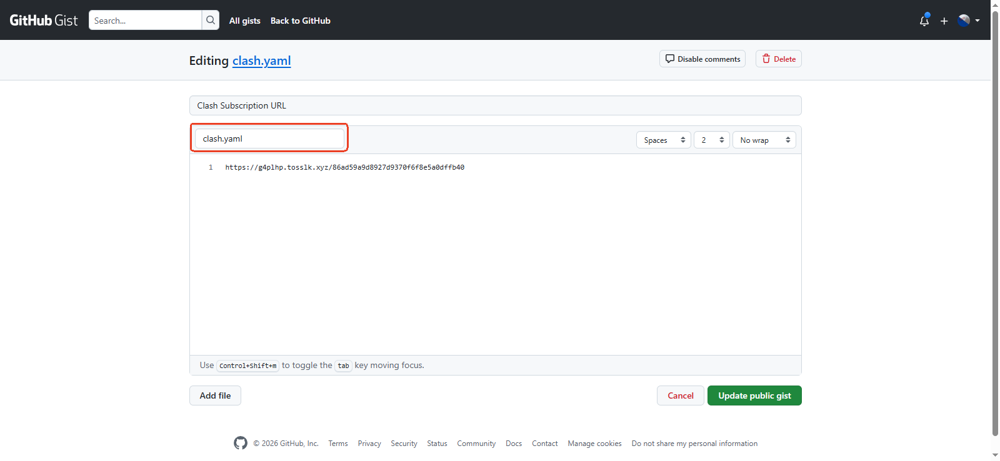
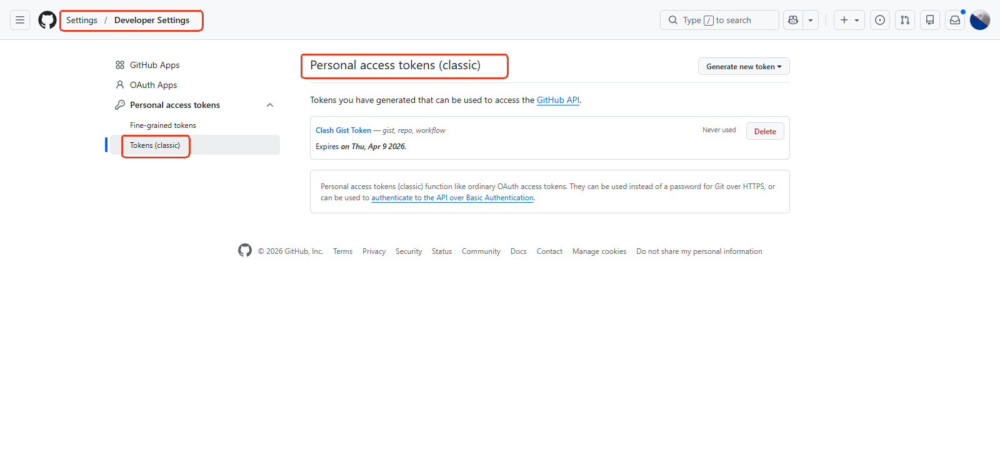
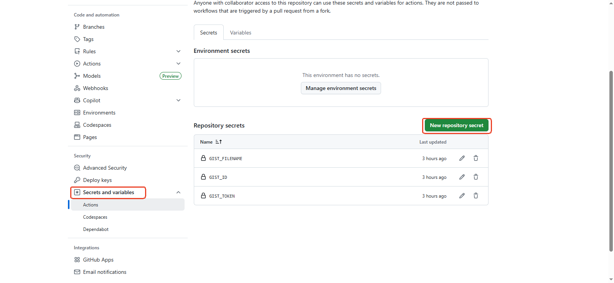

# ClashSubscription

[TOC]

## 一、需求描述

[https://github.com/tolinkshare2/tolinkshare2.github.io](https://github.com/tolinkshare2/tolinkshare2.github.io) 此项目提供一个不定时更新的Clash订阅地址，但是更新新的地址后就需要手动访问此项目复制 Clash 地址再手动导入到 Clash Verge Windows 应用，整个过程手动处理比较麻烦。需要构建一个固定的订阅地址，再结合 Clash Verge 本身支持 **内置自动刷新** 功能，就可以无感使用。

## 二、整体架构

```
GitHub 页面 → Shell 脚本(提取) → GitHub Gist(存储) → Clash Verge订阅(设置定时更新) → GitHub Actions（定时执行）
```

1. **从 GitHub 页面提取最新的订阅链接**
2. **提取订阅链接的内容，并更新到 GitHub Gist**
3. **Clash Verge 导入 Github Gist 作为订阅地址，并设置定时更新**
4. **GitHub Actions 实现自动执行 Shell 脚本** 

## 三、实现流程

### 3.1 创建 GitHub Gist

1. 登录 GitHub → 点击右上角 **+** → **New gist**，或者直接访问 [https://gist.github.com](https://gist.github.com)
2. **Description**: `Clash Subscription URL`
3. **Filename**: `clash.yaml`
4. **内容**: 任意输入内容
5. 点击 **Create public gist**
6. **复制 Gist 的 URL**，格式类似：
   `https://gist.githubusercontent.com/[你的用户名]/[Gist ID]/raw/clash.yaml`

> **浏览器地址栏复制 Gist ID**（最后的字符串）：

   - URL: `https://gist.github.com/你的用户名/`**`abc123def456...`**
   - Gist ID 就是: **`abc123def456...`**



### 3.2 创建 Personal Token

1. 登录 GitHub → **Settings** → **Developer settings** → **Personal access tokens** → **Tokens (classic)**
2. 点击 **Generate new token (classic)**
3. **Note**: `Clash Gist Token`
4. **Expiration**: 选择 `No expiration`（或 30 天）
5. **Select scopes**: 勾选 **`gist`** ✅
6. 点击 **Generate token**
7. **复制并保存 token**（只显示一次！）



### 3.3 配置 Shell 脚本

```
sync-clash.sh
```

脚本中包含 Gist 配置（从环境变量读取）

```bash
GIST_ID="${GIST_ID}" 				# 例如：abc123def456...
GIST_FILENAME="${GIST_FILENAME:-clash.yaml}"
GIST_TOKEN="${GIST_TOKEN}"			# 例如：ghp_xxxxxxxxxxxx...
```

运行脚本

```bash
# 添加执行权限
chmod +x /workspace/sync-clash.sh

# 后台运行(测试使用)
nohup /workspace/sync-clash.sh > /dev/null 2>&1 &

# 查看运行状态
ps aux | grep sync-clash

# 停止脚本
pkill -f sync-clash.sh
```

验证测试

```bash
# 查看日志
cat clash_getter.log

# 查看本地记录
cat clash_subscription.txt

# 访问Gist确认上传成功
# https://gist.github.com/你的用户名/你的Gist_ID
```

### 3.4 配置 GitHub Actions 工作流

```
.github/workflows/clash-sync.yml
```

**配置执行频率**：如果担心 GitHub Actions 分钟数不够用，可以改为 15 分钟或 30 分钟

```yaml
schedule:
  # 每15分钟执行
  - cron: '*/15 * * * *'
```

### 3.5 配置 GitHub 仓库

**创建 GitHub 仓库**：创建新仓库或使用现有仓库，并配置 GitHub Secrets


1. **添加 Secrets**：
   - 进入仓库 → **Settings** → **Secrets and variables** → **Actions**
   - 点击 **New repository secret**
2. **添加以下 Secrets**：

| Secret 名称 | 值 | 说明 |
|-------------|-----|------|
| `GIST_ID` | 你的 Gist ID | Gist 页面 URL 中的字符串 |
| `GIST_TOKEN` | 你的 GitHub Personal Token | 需包含 `gist` 权限 |
| `GIST_FILENAME` | `clash.yaml` | Gist 文件名（可选） |


**完整文件结构**

```
你的仓库/
├── sync-clash.sh              # 同步脚本
├── .github/
│   └── workflows/
│       └── clash-sync.yml     # GitHub Actions配置
└── README.md                  # 可选：项目说明
```

**上传文件到仓库**

```bash
# 初始化仓库
git init
git add .
git commit -m "Add Clash auto-sync workflow"
git branch -M main

# 添加远程仓库（替换为你的仓库URL）
git remote add origin https://github.com/你的用户名/仓库名.git

# 推送到GitHub
git push -u origin main
```

**验证运行**

1. **查看 Actions 执行状态**：
   - 进入 GitHub 仓库 → **Actions** 标签
   - 可以看到 **Clash Subscription Auto Sync** 工作流
   - 每 5 分钟会自动执行一次

2. **手动触发测试**：
   - 进入 **Actions** → 选择工作流 → 点击 **Run workflow**

3. **检查 Gist 是否更新**：
   - 访问你的 Gist 页面
   - 查看 `clash.yaml` 内容是否已更新

这样就实现了完整的自动化流程：GitHub Actions 自动运行，Linux 每 5 分钟提取最新链接并上传到 Gist， Clash Verge 每 5 分钟更新获取 Gist ，完全无需手动操作！

**执行流程**

```
┌─────────────────────────────────────────────────────────────┐
│  1. get_clash_link()                                        │
│     从GitHub页面提取订阅链接                                  │
│     例如：https://dxMCfu.tosslk.xyz/833c1ff294497bee...    │
└─────────────────────────────────────────────────────────────┘
                          │
                          ▼
┌─────────────────────────────────────────────────────────────┐
│  2. get_subscription_content()                              │
│     curl -s 订阅链接，下载实际配置内容                        │
│     返回YAML格式的Clash配置                                  │
└─────────────────────────────────────────────────────────────┘
                          │
                          ▼
┌─────────────────────────────────────────────────────────────┐
│  3. upload_to_gist()                                        │
│     将订阅内容（YAML配置）上传到Gist                          │
│     Clash Verge 端直接使用Gist中的内容                            │
└─────────────────────────────────────────────────────────────┘
```

### 3.6 Clash Verge 使用

在 Clash Verge 中直接使用 Gist 的 **Raw URL**：

```
https://gist.githubusercontent.com/你的用户名/你的Gist_ID/raw/clash.yaml
```

这样 Clash Verge 就会下载并使用 Gist 中存储的完整订阅配置，无需再访问原始的订阅链接！